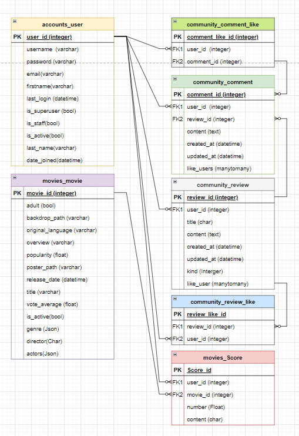
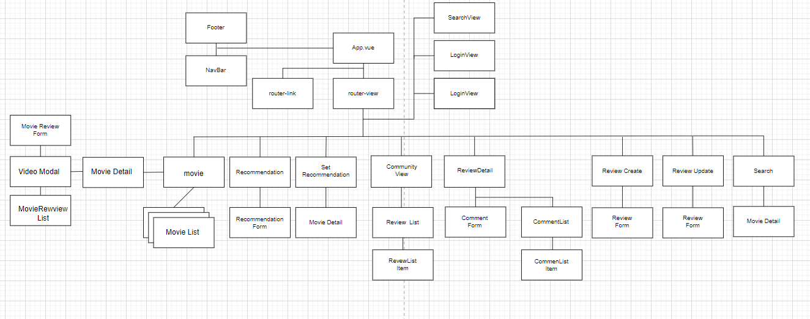

# READ ME

## 프로젝트 요약

**vue.js 와 Django, Python, TMDB API를 활용한 데이터 기반 영화추천 사이트 개발**

- TMDB API와 YouTube API를 활용하여 영화 정보 제공
- 군집분석 알고리즘을 활용한 사용자 맞춤형 영화 추천
- Weather와 시간정보를 활용한 영화 추천
- 한줄리뷰와 게시판을 활용하여, 부족한 정보를 유저들끼리 공유할 수 있도록 함

## 팀원 정보 및 업무 분담 내역

#### 1. 팀원 정보
   - 11조
   - 팀장 : 허건녕
   - 팀원 : 김채리  / 이동욱

#### 2. 역할 분담
   - Server Side : 이동욱
   - Client : 김채리 / 허건녕

   

## 목표 서비스 구현 및 실제 구현 정도

#### 1. 목표(구현된 서비스는 완료로 표현)

- 추천 알고리즘 (사용자 기호에 따른 ML-데이터API ) **(완료)**
- 영화 홈 6종류 이상의 컴포넌트 및 carousel 구현 (날씨별 어울리는 영화, 시간별 어울리는 영화 등) **(완료)**
- 영화 디테일 비동기식 modal **(완료)**
- 영화 검색 기능 **(완료)**
- 로그인, 로그아웃, 회원가입 **(완료)**
- 게시판 -자유 게시판 / 핫 게시물 **(완료)**
- 근처 영화관 알려주기 (위치 데이터 기반) (미완)
- 관리자 영화 등록/수정/삭제기능 **(완료)**

#### 2. 추가 구현

- 로그인 토큰 이용
- 게시판 좋아요, 댓글 좋아요 기능
- 영화 세부 정보에 youtube연동하여 예고편 시청 가능하고 사용자 한 명당 평점과 평을 작성, 수정, 삭제 기능과 사용자 평점 평균 기능
- 영화를 순위와 장르에 따라서 분류 기능
- 배포

## 데이터베이스 모델링 (ERD)

## 컴포넌트 구조

## 필수 기능 설명

#### 1.  Home

 **Back**
  - 요약 : 영화(상영, 날씨, 시간, 평점, 한국, 애니메이션)를 6개로 분류해 총 60개를 전송한다.
    - 상영 - 현재 상영하고 있는 영화 1~10순위까지 영화 데이터 10개를 전송한다.
    - 날씨 - ['Thunderstorm', 'Drizzle', 'Rain', 'Snow', 'Atmosphere', 'Clear', 'Clouds'] 위의 날씨에 어울리는 영화 장르를 아래와 같이 나눈 후에 현재 날씨에 맞춰서 유명한 영화 10개 전송한다.
      - [["Horror", "Thriller"], ["Music", "Animation"], ["Crime", "Action"], ["Romance", "TV Movie"], ["Mystery", "Western"], ["Comedy", "Drama"], ["War", "Adventure"]]
    - 시간 - 시간대 별로 보기 좋은 장르를 아래와 같이 나눠서 평점이 가장 높은 영화 10개 전송한다.
      - ["Family", "History", "Fantasy", "Documentary"]
    
    - 평점 - 평점을 남긴 관객 수와 평점을 바탕으로 명작 10개를 반환한다.
    
    - 한국 - 한국 영화 유명 높은 순으로 10개 반환한다
    
    - 애니메이션 - 애니메이션 영화 유명 순으로 10개 반환한다.

**Front**

- 요약 : 메인 컴포넌트 1개와 5개의 서브 컴포넌트로 구성되어 있고, 이들 모두 캐러셀 형식으로 노출한다.
  - 메인 컴포넌트 
    - 현재 상영하고 있는 영화 데이터를 전달받아 Bootstrap 캐러셀 형식으로 노출 한다. 
    - 캐러셀 이미지는 배경 이미지를 Gradient화 하여 메인 타이틀과 요약을 보여주고, Modal 형식의 디테일페이지로 이동할 수 있는 버튼을 제공한다.
    
  - 서브 컴포넌트  
    - 날씨 / 시간 / 평점 / 한국영화 / 애니메이션의 총 5가지 주제로 분류된 데이터를 전송받아 카드 캐러셀 형식으로 노출한다. 
    
    - 카드 캐러셀은 반응형으로 제작하여 웹의 사이즈에 따라 노출되는 개수에 차이를 두었고,  Hooper 라이브러리를 사용하여 디자인을 완료했다. 
    
    - 메인 컴포넌트와 동일하게 카드 각각은 영화 Modal 형식의 디테일 페이지로 이동 가능하다.
    
      

#### 2. Detail

**Back**

- 홈에서 받아온 영화 정보를 전체 json으로 반환해 준다. 
- front에서 영화의 review를 저장하여 db에 있는 영화의 평과 평점을 반환해 준다. 
- review 수정, 삭제 기능이 포함되어 있다.

**Front**

- 요약 :  디테일 창에서 새로고침없이 영화정보, 영화예고편, 관련리뷰와 평점을 한번에 확인하도록 구현하여 UX를 향상시킨 디자인
  - 영화추천페이지에 특성 상 고객들이 다양한 정보를 쉽고 빠르게 취득해야 한다는 점을 주목했다. 다양한 방법을 고민하던 중 영화정보를 확인할 때, 창이 바뀌거나 새로고침을 하는 것이 아닌, 모달을 작동 시켜서 정보취득도 쉽고, 창 전환이 쉽게 구현하였다.
  - 서버에서 제공해주는 Backdrop_path와 그라데이션을 활용하여 디자인과 UX를 모두잡기위해 노력하였다.
  - Youtube API를 활용하여, 서버에서 제공하는 영화정보 뿐이 아닌 예고편정보도 고객들에게 제공해주어 영화정보를 추가적으로 획득 할 수 있도록 도움을 주었다.
  - 한줄리뷰를 비동기방식으로 구현하였다. 자신이 작성하는 리뷰가 새로고침없이 반영(작성, 수정, 삭제) 되는 것을 확인할 수 있게함으로써 UX를 향상시키기 위해 노력했다.
  
  

#### 3. Recommendation

**Back**

- 요약 : 사용자가 선택한 3개 이상의 영화 데이터를 받아와 알고리즘을 거쳐 추천 영화 6개를 반환 시켜준다.(군집 분석)
  - 콘텐츠 기반 필터링 추천 시스템  
  - 사용자가 특정한 아이템을 선호하는 경우, 그 아이템과 비슷한 아이템을 추천하는 방식(ML)이다.
  - 구체적인 내용
    - 영화들의  각 장르를 기준으로 각 단어들을 하나의 문장으로 변환한 후   CountVertorize해서 단어들의 카운트로 여러 장르를 vertorize 한다.
    - train dataset에 fit_transform 해서 train data에 있는 mean(평균)과 variance(분산) 학습을 한다.
    - 위 데이터의 벡터 간의 코사인 각도를 이용하여 구할 수 있는 두 벡터의 유사도를 도출했다.
    - 위 유사도를 내림차순으로 정렬하여 가장 유사도가 높은 영화들이 앞으로 올 수 있도록한다.

    - 평점과 평점을 매긴 사람들을 숫자를 통해서 가중치 평점을 구한다.

    - 고객이 선택한 영화를 유사도 데이터와 가중치 평점 데이터를 활용하여 비슷한 장르를 가지고 평점이 높은 영화를 반환해주는 알고리즘이다.

**Front**

- 요약 : 사용자에게 영화 30개를 노출해주고, 이 중 보고 싶은 영화 3가지 이상을 선택하여 이와 유사한 영화 6개를 반환하여 추천해준다.

  - 랜덤 영화 30개를 DB에서 전달받아 카드 형식으로 노출 시켜준다. 이 때에는 페이지를 반응형으로 제작하여 웹 사이즈에 따라 한 줄에 노출되는 카드의 개수에 차이를 주었다.
  - 30개 중 3가지 이상을 선택할 수 있도록 한다. 클릭이 된 선택지의 pk 값을 Array에 저장하여 DB로 전달한다.

  - 전달한 영화에 대한 추천 값을 리턴받아 카드로 노출시켜준다.

  

#### 4. Community

**Back**

- 요약 : 자유 게시판에 게시물을 작성, 수정, 삭제 기능과 게시물의 분류하고 리스트, 세부 내용을 반환 해준다. 
  - 게시글 CRUD외에도, 게시물의 좋아요 기능까지 구현을 했다.
  - 게시물에 대한 댓글 작성, 수정, 삭제, 좋아요 기능을 구현 해주었다.

**Front**

- 요약 : 사이트의 메인 요소인 영화페이지의 테마를 유지하면서, 유저들이 다양한 게시판에서 추가적으로 다양한 정보를 교류 할 수 있도록 디자인을 했다.

  - 기본 기능으로 게시글 수정, 삭제, 좋아요, 댓글 수정, 삭제, 좋아요 기능을 구현하였다.
  - 서버에서 받아온 데이터 중 게시글 타입정보를 이용하여 다른 게시판을 확인하고 싶을 때, 새로고침으로 넘어가지 않고, 비동기 방식으로 넘어갈 수 있게 구현했다.

  - 게시글의 좋아요 정보를 이용하여 핫게시판을 클라이언트 사이드에서 만들어서 구현했다.

  - 게시글 / 댓글 좋아요를 비동기식으로 구현하여 UX를 향상시키기 위해 노력했다.

#### 5. Account

**Back**

- 요약 : 로그인, 로그아웃, 회원가입과 토큰, 로그인 확인 기능을 제공했다.

**Front**

- 요약 : 로그인, 로그아웃, 회원가입 router를 만들어 현재 로그인된 유저를 파악한다.

  - 로그인 인증키(토큰)가 생성되면, DB에 토큰을 전달하여 해당 유저가 권한이 있는 유저임을 파악하도록 한다.
  - 로그아웃 시 토큰을 삭제하고 alert를 통해 로그아웃 되었다는 것을 알려준다.
  - 회원가입 시 토큰을 저장하고, 자동으로 로그인 된 상태로 main으로 보내준다.
  - 토큰이 없는 유저는 로그인 되지 않은 유저이므로, 로그인, 회원가입, 서비스 초기 메인 화면 외에는 접근이 불가능하도록 하고, 이에 따라 nav의 형식도 변경될 수 있도록 구현했다.

  

#### 6. Search

**Back**

- front에서 받아온 query를 바탕으로 타이틀에 query값이 포함된 영화 들을 filtering 해서 영화 데이터셋을 JSON으로 반환 해주었다.

**Front**

- 요약 : 사용자에게 입력받은 정보를 navbar의 form을 통해 서버에 보내고, 그에대한 리턴값(검색결과)를 사용자에게 보여주었다.
  - 리턴 값에 대한 노출은 card를 통해 반응형으로 제작하였다. card를 선택했을 시 영화 디테일 컴포넌트로 이동한다.
  - 홈에서 사용한 디테일 컴포넌트를 활용하여 재사용하였기 때문에 개발 비용을 줄일 수 있었고 , 유지보수 시 원할하게 작업할 수 있도록 하였다.

#### 7. Admin

**Back**

- 관리자 유저가 영화 등록, 수정, 삭제 기능을 사용할 수 있도록 Admin을 제공한다.

## 느낀 점

**허건녕**

- 프로젝트 기획, 구현, 개발 과정을 처음부터 끝까지 해보는 건 처음이였는데, 기획과정에서의 중요함을 깨달을 수 있었다. 기획과정에서 팀원분들과 다양한 의견을 교환하는 과정에서 의견들이 다듬어 질 수 있었던 것 같다.
- 프로젝트를 진행하면서 코드 부문에서 나타나는 오류도 있지만, 협업과 프로젝트 계획과정에서도 오류나 에로사항이 많이 발생하였다. 각각의 에로사항이 나타날 때, 혼자서 해결하기보다는 팀원들과 소통하는 해결의 중요성을 느꼈다.
- 코드를 잘작성하는 것도 중요하고, 다른 레퍼런스를 참조하는 것도 중요하지만 가장 중요한것은 소통을 통해서 기존의 실수나 놓친점을 보완해 나가는 과정인것 같다. 같이 일주일동안 고생한 팀원 분들과 나 자신이 자랑스럽다!

**김채리**

- 기존 페어 프로그램에서 만날 수 없었던 새로운 문제 상황이 발생했고, 이를 해결하기 위해서 다시 Git 공부를 했었다. 앞으로의 프로젝트 상황에서 만날 수 있는 문제점이 구현에 대한 부분 보다는 협업 과정에서 발생할 수 있는 문제점이 많지 않을까 하는 생각이 들었다. 따라서 팀원들과 함께 문제를 해결해 나가는 방법에 대해서 지속적으로 소통하고 적극적으로 참여해야 함을 느꼈다.
- 기획 단계에서 프로젝트에 대한 개괄적이 내용을 많이 다루는 것이 얼마나 중요한 것인지 이번 프로젝트를 통해 많이 느낀 것 같다. 이전에는 프로젝트 단계에서 기획은 가볍게 훑고 지나가는 영역이라고 생각해왔다. 그 시간을 아껴서 더 많이 개발을 할 시간을 확보해야 된다고 생각했는데, 사실 기획을 디테일하게 짤 수록 더 많은 시행착오를 줄이기 때문에 시간이 절약된다는 사실을 많이 배운 것 같다.
- 협업의 과정이다보니 모르는 부분을 함께 해결하고, 잘못이 있는 부분을 함께 찾을 수 있기 때문에 개인 프로젝트 보다 훨씬 질 좋고, 수준 높은 수준에서 개발할 수 있었다. 동시에, 팀으로 할 때 함양해야 하는 자세도 배울 수 있었다.

**이동욱**

- Data, model이 계획대로 이루어 지지 않았고 많은 수정을 했던 것 같습니다. 다음 data구성과 model을 할 때에는 계획은 오래 동안 완벽하게 구성한 뒤에 프로젝트를 시작해야 한다는 것을 느꼈습니다.
- Back에서 많은 것을 배웠습니다. 예를 들어 Back에서 queryset을 list로 만들어서 더해 serializer를 할 수 있음을 알았습니다. 또한 django 에서 list를 받아 오려면 manytomanyfield를 이용해서 모델을 하나 만드는 방법도 있지만, 받아 올 때 원하는 결과 값으로 변환해서 받아온 뒤에 JSONField로 바로 받아오는 방법이 있었습니다.
- Back을 완료하고 front 평점 부분을 했었는데 이제 다른 사람이 쓴 코드도 읽어가면서 구성을 조작을 할 수 있었음을 느꼈습니다.
- 역할을 분배하고 소통과 협업을 함으로 서로 도와가면서 많은 팀의 중요성을 깨달았고 팀으로 함께 했을 때 더 좋은 결과를 얻을 수 있었습니다.****